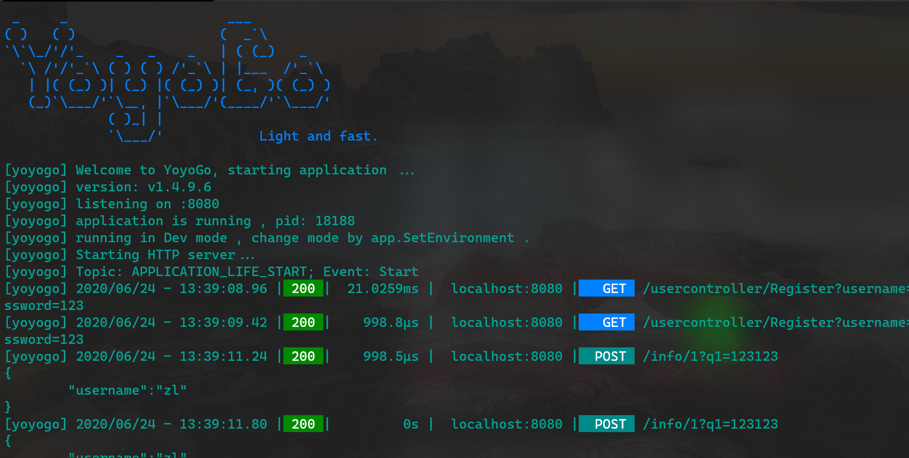

# YoyoGo
YoyoGo is a simple, light and fast Web framework written in Go. 

[](https://goreportcard.com/report/github.com/maxzhang1985/yoyogo)

[](https://travis-ci.org/maxzhang1985/yoyogo)
[](https://godoc.org/github.com/maxzhang1985/yoyogo)
[](https://opensource.org/licenses/MIT)


# Features
- Pretty and fast router 
- Middleware Support
- Friendly to REST API
- No regexp or reflect
- Inspired by many excellent Go Web framework

## Contributing
> I will be glad if you contribute to this library. I don't know much
> English, so contributing to the documentation is very meaningful to me.
> If you found a bug and create an issue, it will be fixed in one day.

[](https://sourcerer.io/fame/maxzhang1985/maxzhang1985/yoyogo/links/0)[](https://sourcerer.io/fame/maxzhang1985/maxzhang1985/yoyogo/links/1)[](https://sourcerer.io/fame/maxzhang1985/maxzhang1985/yoyogo/links/2)[](https://sourcerer.io/fame/maxzhang1985/maxzhang1985/yoyogo/links/3)[](https://sourcerer.io/fame/maxzhang1985/maxzhang1985/yoyogo/links/4)[](https://sourcerer.io/fame/maxzhang1985/maxzhang1985/yoyogo/links/5)[](https://sourcerer.io/fame/maxzhang1985/maxzhang1985/yoyogo/links/6)[](https://sourcerer.io/fame/maxzhang1985/maxzhang1985/yoyogo/links/7)
# Installation

`go get github.com/maxzhang1985/yoyogo`


# Example
```golang
package main

import ...


func main() {
	//webHost := YoyoGo.CreateDefaultWebHostBuilder(os.Args,RouterConfigFunc).Build()
	webHost := CreateCustomWebHostBuilder(os.Args).Build()
	webHost.Run()
}

//* Create the builder of Web host
func CreateCustomWebHostBuilder(args []string) *YoyoGo.HostBuilder {
	return YoyoGo.NewWebHostBuilder().
		UseFastHttp(":8080").
		//UseServer(YoyoGo.DefaultHttps(":8080", "./Certificate/server.pem", "./Certificate/server.key")).
		Configure(func(app *YoyoGo.ApplicationBuilder) {
			app.UseStatic("Static")
		}).
		UseRouter(RouterConfigFunc).
		ConfigureServices(func(serviceCollection *DependencyInjection.ServiceCollection) {
			serviceCollection.AddTransientByImplements(models.NewUserAction, new(models.IUserAction))
		})
}

//*/

//region router config function
func RouterConfigFunc(router Router.IRouterBuilder) {
	router.GET("/error", func(ctx *Context.HttpContext) {
		panic("http get error")
	})

	router.POST("/info/:id", PostInfo)

	router.Group("/v1/api", func(router *Router.RouterGroup) {
		router.GET("/info", GetInfo)
	})

	router.GET("/info", GetInfo)
	router.GET("/ioc", GetInfoByIOC)
}

//endregion

//region Http Request Methods

type UserInfo struct {
	UserName string `param:"username"`
	Number   string `param:"q1"`
	Id       string `param:"id"`
}

//HttpGet request: /info  or /v1/api/info
//bind UserInfo for id,q1,username
func GetInfo(ctx *Context.HttpContext) {
	ctx.JSON(200, Std.M{"info": "ok"})
}

func GetInfoByIOC(ctx *Context.HttpContext) {
	var userAction models.IUserAction
	_ = ctx.RequiredServices.GetService(&userAction)
	ctx.JSON(200, Std.M{"info": "ok " + userAction.Login("zhang")})
}

//HttpPost request: /info/:id ?q1=abc&username=123
func PostInfo(ctx *Context.HttpContext) {
	qs_q1 := ctx.Query("q1")
	pd_name := ctx.Param("username")

	userInfo := &UserInfo{}
	_ = ctx.Bind(userInfo)

	strResult := fmt.Sprintf("Name:%s , Q1:%s , bind: %s", pd_name, qs_q1, userInfo)

	ctx.JSON(200, Std.M{"info": "hello world", "result": strResult})
}
```



# ToDo
## Standard
* [X] Print Logo (YoyoGo)
* [X] Unified program entry (YoyoGo)
* [X] Simple router binded handle func
* [X] HttpContext (request,response)
* [X] Static File EndPoint（Static File Server）
* [X] JSON Serialization Struct （Std.M）
* [X] Get Request File And Save
* [X] Unite Get Post Data Away (form-data , x-www-form-urlencoded)
* [X] Binding Model for Http Request ( From, JSON ) 
### Response Render
* [X] Render Interface
* [X] JSON Render
* [X] JSONP Render
* [X] Indented Json Render
* [X] Secure Json Render
* [X] Ascii Json Render
* [X] Pure Json Render
* [X] Binary Data Render
* [X] TEXT
* [X] Protobuf
* [X] MessagePack
* [X] XML
* [X] YAML
* [X] File
* [X] Image
* [ ] Template
* [ ] Auto formater Render

## Middleware
* [X] Logger
* [X] StaticFile
* [X] Router
* [X] Router Middleware
* [ ] Session
* [ ] CORS
* [X] Binding
* [ ] GZip	


## Router
* [x] GET、POST、HEAD、PUT、DELETE Method Support
* [x] Router Tree
* [x] Router Expression
* [x] RouteData (var)
* [x] Router Support Struct Refect Func Binded.
* [x] Router Support Prefix and Group Such as "/api/v1/endpoint"
* [ ] Router Filter
* [ ] Controller Router And Router Tempalte (Default)

## Dependency injection
* [X] Dependency injection Framework
* [X] Dependency injection Integration

## Features
* [ ] swagger
* [ ] configtion
* [ ] WebSocket
* [ ] GRpc
* [ ] JWT 
* [ ] OAuth2	 
* [ ] Prometheus 
* [ ] Secure
* [ ] JWT 
